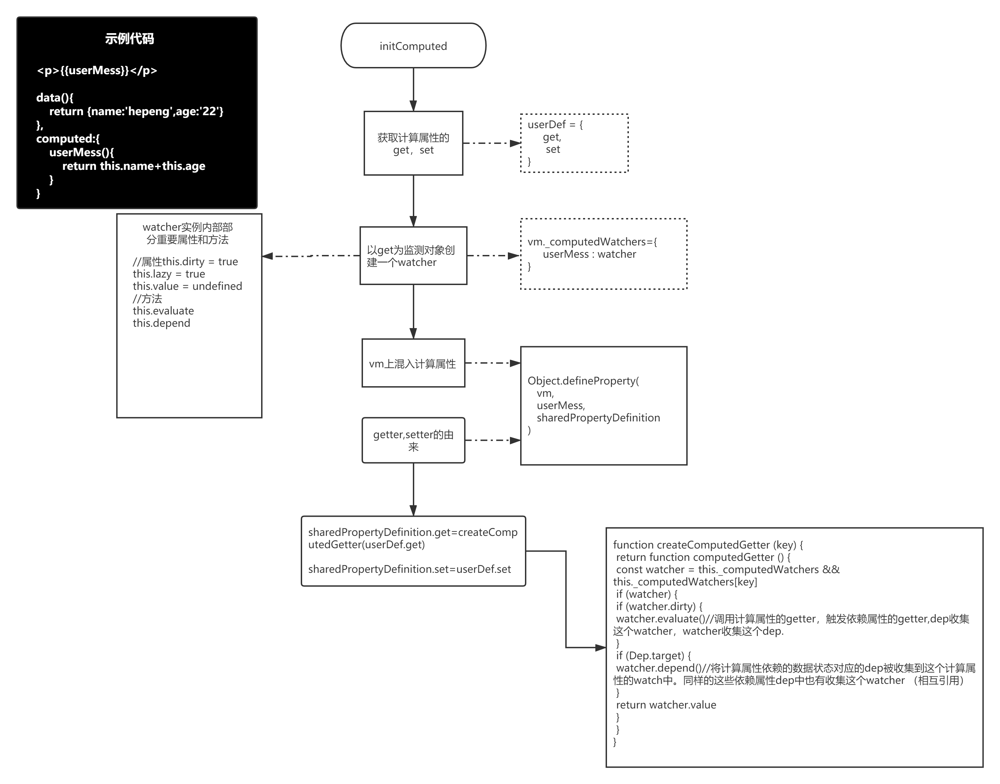
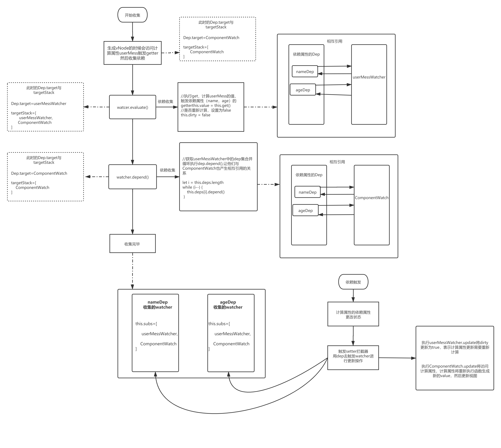

对于用过Vue的同学来说，当前这个属性假如是计算属性，那么也可以用methods和watch实现，如下

```
//computed实现
<p>{{userMess}}</p>
data(){
    return {
        name:'hepeng'，
        age:'18'
    }
}
computed:{
    userMess(){
        return `我的名字是${this.name},年龄是${age}`;
    }
}

//methods实现
<p>"{{userMess()}}"</p>
methods:{
    userMess(){
        return `我的名字是${this.name},年龄是${age}`;
    }
}

//watch实现
data(){
    name:'hepeng'，
    age:'18',
    userMess:''
},
watch:{
    name(){
        this.userMess=`我的名字是${this.name},年龄是${age}`
    }
    age(){
        this.userMess=`我的名字是${this.name},年龄是${age}`
    }
}

```
通过上面简单的栗子(和Vue官网一样的栗子)，对于一个简单需求：我们的一个数据需要根据其他一个或者多个数据变化而变化时，最佳
选用方案是computed

对于method（方法），假如我们的数据量较大，是从一组数据中进行筛选，然后得到结果，那在每一次DOM渲染的时候，我们都需要
去重新调用一遍对应的方法，不管这个方法(userMess)依赖的数据(name,age)有没有变化，其次在模板中的嵌入方式，感觉有点膈应(-__-)

对于computed(计算属性)，当我们访问userMess时，会执行一次对应的计算属性函数，并把这次结果缓存下来，下次在访问时，直接读取缓存，
而不是重新执行计算属性函数，当依赖属性（name、age）中的任意一个发生变化时，都将记录下这次变化，当我们在访问时就会重新执行计算属性
函数得到新的值。

对于watch（侦听属性），当从上面的代码来看就感觉好麻烦，一股硬编码的气息铺面而来，依赖两个属性我们就需要创建两个watch，这样很明显就是在
乱用watch，watch是侦听一个属性的变化而执行其对应的回调，他的开销比computed大。通常情况下，对于一个数据变化，我们需要做有操作时，我们用watch。


总结：
1. 对于computed和watch，在能用computed实现需求的时候，我们优选computed，computed相对于watch开销小、性能高。
2. 对于computed和method，我们需要获取实时数据，不希望存在缓存的时候我们采用methods,例如，Date.now() 获取实时的时间。


下面我们来看下这三种模式在Vue中源码的实现

```
//文件路径：src/core/instance/init.js
Vue.protptype._init=function(){
    //忽略其他代码....
    initState(vm)  //初始化数据状态
}
export function initState (vm: Component) {
    vm._watchers = []
    const opts = vm.$options
    //初始化props选项
    if (opts.props) initProps(vm, opts.props)
    //初始化methods选项
    if (opts.methods) initMethods(vm, opts.methods)
    //初始化data选项
    if (opts.data) {
        initData(vm)
    } else {
        observe(vm._data = {}, true /* asRootData */)
    }
    //初始化计算属性选项
    if (opts.computed) initComputed(vm, opts.computed)
    //初始化watch
    if (opts.watch && opts.watch !== nativeWatch) {
        initWatch(vm, opts.watch)
    }
}
```
上述代码中，我们可以看到依次初始化props,methods,data,computed,watch。这里我们先只介绍methods的初始化，后面将介绍watch和computed的初始化，
从源码及了解他们的不同。

#### methods 
methods: 作为组件实例化时的options（选项）中的一项，methods将混入Vue实例中，可以直接通过vm实例访问这些方法，或者在指令表达式中使用，方法中的this
自动绑定为Vue实例，在Vue源码中，我们在Vue的原型方法_init(初始化)中对methods选项进行初始化

```
function initMethods(vm,methods){
    const props = vm.$options.props
    for (const key in methods){
        //省略部分判断...
        if (props && hasOwn(props, key)) {
            warn(
                `Method "${key}" has already been defined as a prop.`,
                vm
            )
        }
        if ((key in vm) && isReserved(key)) {
            warn(
                `Method "${key}" conflicts with an existing Vue instance method. ` +
                `Avoid defining component methods that start with _ or $.`
            )
        }
    }
    vm[key] = typeof methods[key] !== 'function' ? noop : bind(methods[key], vm)
}
```
上述代码初始化methods选项，代码非常简单，因为props选项的数据也将挂载到vm实例上，先检查是否重名，然后在检查methods选项中对应的方法
名在实例上是否存在，并且以‘$’或者‘_’开头，上面两个条件都不符合表示通过，可以将这个方法名挂载到vm上，然后执行最重要的一段代码
vm[key] = typeof methods[key] !== 'function' ? noop : bind(methods[key], vm)，vm上添加对应的方法名作为属性，value为：假如methods[key]不是一个函数
则我们给个备用的，否则执行bind(methods[key], vm)，改变对应方法的this指向为当前vm。


#### watch

watch：作为组件实例化options中的一项，是一个对象，键是需要观察的表达式，值是对应的回调函数，或者包含选项的对象。Vue 实例将会在实例化时调用 $watch()，遍历 watch 对象的每一个 property。
用法截取Vue官网的中的例子
```
watch: {
    a: function (val, oldVal) {
        console.log('new: %s, old: %s', val, oldVal)
    },
    // 方法名
    b: 'someMethod',
    // 该回调会在任何被侦听的对象的 property 改变时被调用，不论其被嵌套多深
    c: {
        handler: function (val, oldVal) { /* ... */ },
        deep: true
    },
    // 该回调将会在侦听开始之后被立即调用
    d: {
        handler: 'someMethod',
        immediate: true
    },
    // 你可以传入回调数组，它们会被逐一调用
    e: [
        'handle1',
        function handle2 (val, oldVal) { /* ... */ },
        {
            handler: function handle3 (val, oldVal) { /* ... */ },
            /* ... */
        }
    ],
    // watch vm.e.f's value: {g: 5}
    'e.f': function (val, oldVal) { /* ... */ }
}

```
之前我们介绍过$watch的实现，在这就不叙述了，有兴趣可以去看看，[传送门](../vue-watcher/index.md)。对于watch选项的初始化我们先看源码。

```
function initWatch (vm: Component, watch: Object) {
    for (const key in watch) {
        const handler = watch[key]
        if (Array.isArray(handler)) {
            for (let i = 0; i < handler.length; i++) {
                createWatcher(vm, key, handler[i])
            }
        } else {
            createWatcher(vm, key, handler)
        }
    }
}
function createWatcher (vm: Component,expOrFn: string | Function,handler: any,options?: Object) {
    if (isPlainObject(handler)) {
        options = handler
        handler = handler.handler
    }
    if (typeof handler === 'string') {
        handler = vm[handler]
    }
    return vm.$watch(expOrFn, handler, options)
}
```
直接for..in循环watch项，如果该项是数组，则循环该数组调用createWatcher,如果该项是对象，则直接调用createWatcher，传入参数
vm:当前组件实例，expOrFn:键值，handler：回调函数以及配置，在createWatcher函数中如果handler是对象，则从这个对象上解析出watch的回调函数和配置，
如果是string，则从vm上获取这个key对应的回调函数，然后调用原型方法$watch实现侦测功能。


#### computed
computed:计算属性将被混入到Vue实例中。所有getter和setter的this上下文自动绑定为Vue实例，如果计算属性的使用的了箭头函数，则this不会指向
这个组件实例，不过仍然可以将其作为函数的第一个参数来访问。在vue中我们通知可以这样定义

```
//此时只定义了计算属性userMess的getter，只拥有只读,当我们直接设置时会报错
{
    computed:{
        userMess(){
            return this.name+''+this.age
        }
    }
}
//此时定义了计算属性的getter和setter，拥有了读取，
{
    computed:{
        userMess:{
            get(){
                 return this.name+''+this.age
            },
            set(val){
                this.name=val
            }
        }
    }
}
```
上面定义方式，其实就是我们定义了这个计算属性的getter和setter，访问时执行getter并缓存起来，下次一直读取，不在重复执行getter去获取，
当getter中依赖的属性状态发生变化时，计算属性会重新计算，因为我们存在一个状态，当第一次getter后这个状态为false，重复进行访问，则
直接返回缓存值，当依赖的属性发生变化时，这个属性会为true，告诉我们下次访问这个计算属性时重新执行getter获取最新值。这个状态是在这个
计算属性的watcher实例中定义的，下面看看源码到底是怎么实现的
```
function initSatte(vm){
    //省略其他代码....
    if (opts.computed) initComputed(vm, opts.computed)
    //省略其他代码...
}

function initComputed (vm: Component, computed: Object) {
    //在当前组件实例上定义_computedWatchers为一个纯空对象，并且声明变量watchers。
    const watchers = vm._computedWatchers = Object.create(null)
    //确定当前是否srr后台渲染
    const isSSR = isServerRendering()
    //for...in循环conputed选项中所有的计算属性
    for (const key in computed) {
        const userDef = computed[key]//获取对应的计算属性函数
        //如果是对象则获取对象上的get，否则就默认当前函数为get
        const getter = typeof userDef === 'function' ? userDef : userDef.get
        //判断平台，如果不在服务端
        if (!isSSR) {
            //创建一个watcher，并添加到vm._computedWatchers（变量watcher）这个对象上，key为当前计算属性的名字
            //我们定义的函数或者get为侦测的内容，这样就将我们计算属性依赖的属性产生依赖关系。
            watchers[key] = new Watcher(
                vm,
                getter || noop,
                noop,
                computedWatcherOptions
            )
        }
        //判断当前这个计算属性是否在vm上已经存在，防止与之前挂载到vm上props、data、methods等冲突
        if (!(key in vm)) {
            //将这个属性添加到当前组件实例vm上，方便直接访问，并添加gettet和setter
            defineComputed(vm, key, userDef)
        } else if (process.env.NODE_ENV !== 'production') {
            if (key in vm.$data) {
                warn(`The computed property "${key}" is already defined in data.`, vm)
            } else if (vm.$options.props && key in vm.$options.props) {
                warn(`The computed property "${key}" is already defined as a prop.`, vm)
            }
        }
    }
}
```
上述函数initComputed为初始化计算属性，传入当前组件实例对象和computed选项对象，然后for...in循环当前组件的计算属性对象，获取
计算属性对应值，如果值是对象，则取get属性赋值为变量getter，如果是函数则直接默认为getter，然后去实例化watcher，这里实例化watcher是重点，
将getter作为watcher的观察对象，回调函数给默认的noop，配置项将lazy设置为true。然后调用defineComputed将计算属性混入vm实例上，defineComputed函数如下

```
export function defineComputed (target: any,key: string,userDef: Object | Function) {
    const shouldCache = !isServerRendering()
    if (typeof userDef === 'function') {
        sharedPropertyDefinition.get = shouldCache
            ? createComputedGetter(key)
            : createGetterInvoker(userDef)
        sharedPropertyDefinition.set = noop
    } else {
        sharedPropertyDefinition.get = userDef.get
            ? shouldCache && userDef.cache !== false
                ? createComputedGetter(key)
                : createGetterInvoker(userDef.get)
            : noop
        sharedPropertyDefinition.set = userDef.set || noop
    }
    if (process.env.NODE_ENV !== 'production' && sharedPropertyDefinition.set === noop) {
        sharedPropertyDefinition.set = function () {
            warn(
                `Computed property "${key}" was assigned to but it has no setter.`,
                this
            )
        }
    }
    Object.defineProperty(target, key, sharedPropertyDefinition)
}
```
defineComputed函数接受三个参数，vm:当前实例，key：当前计算属性的名字，userDef：当前计算数属性的值，为函数(getter)或对象(getter,setter)。
在该函数中通过通过判断是否区分是否在浏览器端，并且userDef是否为函数或者对象，当在浏览器时，如果userDef为函数，则默认为get，对象时分别取出
get和set，然后调用createComputedGetter对get进行包装，然后作为sharedPropertyDefinition的get，set，并用Object.defineProperty去vm上创建以计算属性为名的getter和setter,做数据劫持操作。
这里createComputedGetter函数如下所示，

```
function createComputedGetter (key) {
    return function computedGetter () {
        const watcher = this._computedWatchers && this._computedWatchers[key]
        if (watcher) {
            if (watcher.dirty) {
                watcher.evaluate()//调用计算属性的getter，触发依赖属性的getter,dep收集这个watcher，watcher收集这个dep.
            }
            if (Dep.target) {
                watcher.depend()//将计算属性依赖的数据状态对应的dep被收集到这个计算属性的watch中。同样的这些依赖属性dep中也有收集这个watcher  （相互引用）
            }
            return watcher.value
        }
    }
}
```
如上述代码所示，这是个高级函数，在里面我们对watcher和dep进行两相互引用。下面我们将上面涉及到的函数统一去解释一下。了解computed的一生，从初始化完成到依赖
项改变是怎么触发视图更新的。

```
//computed的模板示例
<p>{{userMess}}</p>

data(){
    return {name:'hepeng',age:'22'}
},
computed:{
    userMess(){
        return this.name+this.age
    }
}   

```
如上述，假如我这样调用，在初始化阶段会做以下事情（排除判断条件，我们这里默认在浏览器端，并且vm上没有userMess这个属性）
1. 获取userMess对应的函数，作为观察对象调用$watch，这里传入回调函数是默认的noop，既没有任何内容的函数，配置项为lazy:true,这样在watcher实例化时，在构造函数中无法
调用watcher中的get方法访问属性触发getter拦截器进行依赖收集。只是将this.dirty设置为true。watcher实例将存放vm._computedWatchers中。key就是当前计算属性的名字，这里我们将
得到的watcher暂时叫做watcherComputedGet,具体得到的类容如下
```
vm._computedWatchers={userMess:watcherComputedGet}
```
2. 给当前实例vm上直接添加计算属性访问属性，属性key为计算属性名，通过Object.defineProperty定义，同时提供这个属性的getter和setter，getter为当前这个计算属性的get，set为
当前计算属性的set，通过createComputedGetter函数进行包装，在getter拦截器中我们听过vm._computedWatchers获取之前定义的watcher（watcherComputedGet），并依次调用watcherComputedGet.evaluate和
watcherComputedGet.depend实例方法，这两个方法我们之前在介绍Watcher源码的时候并没有提交，现在我们补充下
```
class Watcher{
    //省略其他代码
    evaluate () {
        this.value = this.get()
        this.dirty = false
    }
    
    depend () {
        let i = this.deps.length
        while (i--) {
            this.deps[i].depend()
        }
    }
}
```
这两个方法代码如上所示，如我们之前computed的模板示例，当我们在模板中去访问计算实现userMess时，在生成vnode的过程中我们会触发这个计算属性的getter，这个时候的watcher实例为当前这个组件的watcher（暂时命名为：componentWatcher）实例，
在触发的getter中我们获取之前存在vm._computedWatchers中的watcherComputedGet（watcher实例），然后判断这个watcher对象dirty属性，这个时候为true，然后我们调用watcherComputedGet.evaluate()
方法，该方法会调用watcher实例的get方法既计算属性（userMess）定义时的get，获取计算属性的最终value，然后将dirty设置为true，这个时候会访问计算属性依赖的数据状态(name和age),触发收集dep收集这个watcher(watcherComputedGet与depName和depAge互相引用),
然后更新Dep.target，即为computedWatcher,然后在调用watcherComputedGet.depend()，这个时候nameDep和ageDep也会收集到这个computedWatcher，这样我们就做完了依赖收集，然后watcherComputedGet.value上赋值我们获取的计算属性value。
这样就造成了，当我们没有改变依赖属性状态时，会直接返回这个value,但是当依赖属性发生变化时，依赖属性的dep会触发watcher，先触发watcherComputedGet,将dirty设置为true，然后会触发computedWatcher更新视图，然后重新访问计算属性userMess，这个时候会调用get重新计算值。
我们用流程图再来解释一下这个流程






