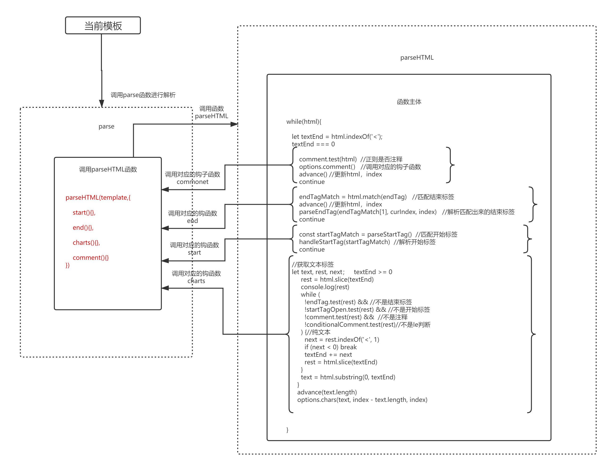

## vue源码剖析——模板编译生成渲染函数

### 什么是render函数
我们在编写.vue文件时一般情况下都需要在template中编写html模板，render函数就是将通过将html模板解析转成而成的函数，
也就是模板的渲染函数。由模板生成render函数时需要经历以下几个过程。

1. 解析器，将Html模板解析成ASTElement
2. 优化器，遍历生成的ASTElement，为每个节点添加静态标记
3. 生成器，将ASTElement生成render函数（渲染函数）


### 解析器
将模板解析成ASTElement,模板解析器中我们可以细分为  文本解析、过滤器解析、html解析。
文本解析器：用来处理文本节点，解析出文本节点中表达式，也可以是纯文本节点。
过滤器解析：将表单式中中的过滤器提取出来。
html解析器：解析标签，以及标签上所有的属性。
在解析过程中，先用正则去匹配确认当前是开始标签或者接受标签或者文本标签，根据不同的结果去调用对应的钩子函数 start(解析开始标签，获取标签上的所有属性),end(处理标签上的所有属性),charts(处理文本节点或者空节点),然后生成对应的ASTElement节点，ASTElement节点由标签上所有的信息组成的json对象，一个ASTElement表示一个节点，对象上的每个属性表示对应的节点信息，如下

```
{
    type:[Number]标签类型   1：元素
    tag:[String] 标签名称
      
    attrList:[Array]  属性集合,[{name:attrName,value:attrValue,start:开始位置,end:结束位置}]
    attrsMap:[Object] 属性集合，与attrList对应 {attrName:attrValue}
    rawAttrsMap:[Object] 属性集合 与attrList对应  {attrName:{name:attrName,value:attrValue,start:开始位置,end:结束位置}}
    
    dynamicAttrs : [attrJson] 属性名是绑定的集合
    attrs:[] 属性名不是绑定的集合    

    eg：<div>   <:为开始位置 ，>：为结束位置
    start:[Number],当前标签开始的位置  
    end:[Number],当前标签结束的位置

    parent:[Object] 当前标签的父级
    children:[Array] 当前标签的子级标签

} 
```
上面仅仅显示ASTElement中比较常见的属性信息，关于节点上的指令属性，绑定属性，特殊属性的表现可以查看[ASTElement详解](./ASTElement详解.md)
#### html解析器
html解析器的主要流程如下图所示




如上图所示，在parse函数中调用parseHTML函数时我们提供了四个钩子函数，start(处理开始标签)、 end(处理结束标签)、chars（处理文本标签）、comment（处理注释），这边我们
只需要特别关注start，end,chars这三个钩子函数

```
   parseHTML(template,{
        start(){}
        end(){}
        chars(){}
        comment()
   }) 

```
通过上述的钩子函数，在正则匹配到不同标签位置时调用不同的函数，然后组成ASTElement,下面我们来具体看一下这几个钩子函数，如何形成一个闭环

* [start钩子函数](./options.start.md)。

    当是开始标签时的钩子函数，会利用参数tag，attrs，unary创建一个ASTElement,并从attrs中取出v-pre,v-for ,v-if, v-once,进行处理，并将对应
的属性挂载到ASTElement上，将ASTElement push 进stack集合，同时确定当前模板的root级，以及默认当前的父级为element

    ```
        let inVPre = false //默认不拥有v-pre指令
        let currentParent
        let root
        let stack
        export function createASTElement (
          tag: string,
          attrs: Array<ASTAttr>,
          parent: ASTElement | void
        ): ASTElement {
          return {
            type: 1,
            tag,
            attrsList: attrs,
            attrsMap: makeAttrsMap(attrs),
            rawAttrsMap: {},
            parent,
            children: []
          }
        }
    
        参数列表
        @params tag:标签名
        @params attrs:标签属性集合
        @params unary:当前是否单个可闭合标签
        @params start:正则符合开始的地方
        @params end:正则符合结束的地方
        start(tag, attrs, unary, start, end){
            //创建一个ASTElement
            let element: ASTElement = createASTElement(tag, attrs, currentParent);
            //检测当前标签是否有v-pre属性，并想element上添加pre属性，表示当前标签以及子集不需要处理上面的表达式
            processPre(element)
            if (element.pre) { 
                inVPre = true
            }
            if (inVPre) {
                //当前拥有v-pre属性时，也是处理v-pre
                processRawAttrs(element)//处理pre标签
            } else if (!element.processed) {//处理标签上的v-for,v-if,v-once属性
                // structural directives
                processFor(element)
                processIf(element)
                processOnce(element)
            }
            if (!root) {//确定根元素
                root = element
            }
            //如果当前不是单个可闭合标签  
            if (!unary) {
                currentParent = element
                stack.push(element)
            } else {
                closeElement(element)
            }
        }
    
    ```

* [end钩子函数](./options.end.md)。

    当是结束标签时的钩子函数，确定当前标签的直属父级currentParent，将当前标签作为currentParent的children,从stack集合中获取当前结束的是哪个element，默认就是stack的最后一个元素，然后从stack删除这个element，在确定该元素
父级，既此时stack的最后一个元素，并调用closeElement函数去处理v-if系列（v-else-if 、v-else）指令 、作用域插槽的（v-slot、scope、slot-scope、slot）指令或属性、组件系列（is、inline-template、ref）属性、自定义系列（指令，属性，事件）

    ```
        end (tag, start, end) {
            const element = stack[stack.length - 1]
            stack.length -= 1
            currentParent = stack[stack.length - 1]
            closeElement(element)
        },
    ```

* [chars钩子函数](./options.chars.md)。
    
    当是文本标签时的钩子函数,确定当前是纯文本节点还是带有表达式的文本节点，分别对应不用的type,为"2"时代表包含表达式的文本节点,
为"3"时代表纯文本节点，调用parseText函数用来解析文本节点中的表达式，如```<p>信息{{message}}信息</p>```中的表达式解析如下
    ```
    res:{
        expression:""信息"+_s(message)+"信息"",
        tokens:["信息",{@binding: "message"},"信息"],
    }
    
    chars(text: string, start: number, end: number){
        const children = currentParent.children
        if (!inVPre && text !== ' ' && (res = parseText(text, delimiters))) {
             child = {
                 type: 2,
                 expression: res.expression,
                 tokens: res.tokens,
                 text
             }
         } else if (text !== ' ' || !children.length || children[children.length - 1].text !== ' ') {
             child = {
                 type: 3,
                 text
             }
         }
    }
    
    ```    
从上述代码中我们可以看出AST的层级关系，为了维护层级关系我们会维护一个stack（栈），在start函数中我们确定root(根元素)、currentParent(当前父级)，我们以currentParent为当前元素的parent，调用createASTElement函数创建AST（确定了父级）。
并将当前节点推入stack（栈）中，然后更新currentParent（用作下次使用，默认当前标签存在子集），当end函数触发时，我们推出当前节点el，确定currentParent(当前父级)，并执行currentParent.children.push(el),确定子集。


回到解析模板的主流程，上面我们知道处理标签的几种钩子函数，那么我们在什么时候去调用呢?同时当我们需要处理很多成对标签时，我们就
需要重复循环调用上面的几种钩子函数，直到模板为空白时则代表解析完毕，下面我们先看一下如何解析各种字符串触发对应的构造函数。

当模板字符串的第一个字符是'<'时，我们进行正则匹配，进行分辨当前是开始标签、结束标签、文本标签、Ie条件注释、Doctype:文档申明
、注释，这里我们主要介绍开始标签、结束标签、文本标签

* 截取解析开始标签，并触发start钩子函数。

    [parseStartTag](./parseStartTag.md)函数主要通过正则解析出当前开始标签的名称并赋值给match.tagName，以及标签上所有的属性并把每对属性添加进match.attrs
    数组中，每处理一次就调用advance函数更新一次html和index，最后返回这个match对象（match.tagName:标签名,match.attrs:属性集合
    ,match.unarySlash ：当前是否是单个可闭合标签）。
    ```
    //开始标签开始位置正则，已精简部分
    const startTagOpen=/^<((?:[a-zA-Z_][\-\.0-9_a-zA-Z]*\:)?[a-zA-Z_][\-\.0-9_a-zA-Z]*)/
    //标签的结束标志
    const startTagClose=/^\s*(\/?)>/
    //标签上的所有属性  
    const dynamicArgAttribute=/^\s*((?:v-[\w-]+:|@|:|#)\[[^=]+\][^\s"'<>\/=]*)(?:\s*(=)\s*(?:"([^"]*)"+|'([^']*)'+|([^\s"'=<>`]+)))/;
    const attribute = /^\s*([^\s"'<>\/=]+)(?:\s*(=)\s*(?:"([^"]*)"+|'([^']*)'+|([^\s"'=<>`]+)))?/
      
    const startTagMatch = parseStartTag()
    if (startTagMatch) {
        handleStartTag(startTagMatch)
        continue
    }
    function parseStartTag () {
        //通过正则获取当前模板的开始标签
        const start = html.match(startTagOpen)
        if (start) {
          const match = {
            tagName: start[1],
            attrs: [],
            start: index
          }
          //更新index，html
          advance(start[0].length)
          let end, attr
           //当前标签是否结束，并且带有属性，获取属性。
          while (!(end = html.match(startTagClose)) && (attr = html.match(dynamicArgAttribute) || html.match(attribute))) {
            attr.start = index
            ///截取获取新的html，去掉正则出来的属性。
            advance(attr[0].length)
            attr.end = index
            match.attrs.push(attr)
          }
          if (end) {
            match.unarySlash = end[1]
            advance(end[0].length)
            match.end = index
            return match
          }
        }
    }
    ```
    通过判断的返回的match对象进行判断是否调用[handleStartTag](./handleStartTag.md)函数对匹配出来的属性进行进一步数据整理，将match.attrs
中每条属性处理成{name,value}的形式，并调用start钩子函数。
    其实这中间我们需要考虑 hr、input等 这种可单个标签出现的处理和p标签中不能出现块元素的问题，我贴的代码中并没有表现出来）

    ```
    function handleStartTag (match) {
        const tagName = match.tagName //获取标签名
        const unarySlash = match.unarySlash //获取当前标签结束时的标识符，
        //isUnaryTag 检测当前标签是不是单个、不用成对出现的标签,如input hr br ||  符号转换成Boolean值
        const unary = isUnaryTag(tagName) || !!unarySlash
        //获取匹配出标签属性的数量
        const l = match.attrs.length
        const attrs = new Array(l)
        for (let i = 0; i < l; i++) {
          const args = match.attrs[i]
          const value = args[3] || args[4] || args[5] || ''
          attrs[i] = {
            name: args[1],
            value: decodeAttr(value, shouldDecodeNewlines)
          }
        }
        //如何当前标签没有闭合标志，则存储到stack数组中，
        if (!unary) {
          stack.push({ tag: tagName, lowerCasedTag: tagName.toLowerCase(), attrs: attrs, start: match.start, end: match.end })
          lastTag = tagName
        }
        options.start(tagName, attrs, unary, match.start, match.end)
      }
    
    ```
  
* 截取解析结束标签，调用end钩子函数
    
    结束标签处理相对开始标签就容易很多，我们不需要在抽取标签的属性信息，[parseEndTag](./parseEndTag.md)函数主要从我们维护的栈（stack）
    中取出对应的开始标签，并调用对应的end钩子函数。
    
    ```
    const endTag=/^<\/((?:[a-zA-Z_][\-\.0-9_a-zA-Z]*\:)?[a-zA-Z_][\-\.0-9_a-zA-Z]*)/
    const endTagMatch = html.match(endTag)
    if (endTagMatch) {
        const curIndex = index
        advance(endTagMatch[0].length)
        parseEndTag(endTagMatch[1], curIndex, index)
        continue
    }
    ```
* 截取解析文本节点。
    因为标签都是 < 开头，对应不是以 < 开头的模板，则到 < 位置前的字符就为纯文本标签，
    但是我们需要考虑假如当前这段字符中就存在 < ,那么我们就需要截取 < 后的所有字符，进行判断，看是否纯文本，并更新textEnd和rest
    直到不满足条件位置，这个时候我们就拿到了标签和标签之前的是文本节点。

    ```
    let text, rest, next
    if (textEnd >= 0) {
        rest = html.slice(textEnd)
        
        while (
            !endTag.test(rest) && //不是结束标签
            !startTagOpen.test(rest) && //不是开始标签
            !comment.test(rest) &&  //不是注释
            !conditionalComment.test(rest)//不是Ie判断
        ) {
            //带有<符号的纯文本
            //while循环查找<，然后更新rest和textEnd
            next = rest.indexOf('<', 1)
            if (next < 0) break
            textEnd += next
            rest = html.slice(textEnd)
        }
        text = html.substring(0, textEnd) //获取所有的纯文本
    }
    //处理当前的文本标签或者空白标签
    if (options.chars && text) {
        options.chars(text, index - text.length, index)
    }
    ``` 
  
* 其他情况处理

    对应模板中出现的script、style、textarea标签中的所有字符我们都当文本节点去处理。
    ```
    while（html）{
         //isPlainTextElement判断是否有上个标签(既开始标签)，或者是不是 'script,style,textarea
        if (!lastTag || !isPlainTextElement(lastTag)) {
            //匹配注释，然后处理注释
            //匹配Ie条件注释验证，然后进行处理
            //匹配 Doctype:文档申明，然后进行处理
            //匹配结束标签,然后进行处理
            //匹配到开始标签,然后进行处理
            //匹配文本标签，然后进行处理
        }else{
            let endTagLength = 0
            const stackedTag = lastTag.toLowerCase()
            const reStackedTag = reCache[stackedTag] || (reCache[stackedTag] = new RegExp('([\\s\\S]*?)(</' + stackedTag + '[^>]*>)', 'i'))
            
            //reStackedTag : /([\s\S]*?)(<\/style|script|textarea[^>]*>)/i
            
            const rest = html.replace(reStackedTag, function (all, text, endTag) {
                //all:当前匹配度的全部内容  ，text当前第一个表达式中值：style中的内容  endTag:第二个表达式中的内容 </style>
                endTagLength = endTag.length  //结束标签的内容
                
                if (!isPlainTextElement(stackedTag) && stackedTag !== 'noscript') {
                    text = text
                        .replace(/<!\--([\s\S]*?)-->/g, '$1') 
                        .replace(/<!\[CDATA\[([\s\S]*?)]]>/g, '$1')
                }
                if (shouldIgnoreFirstNewline(stackedTag, text)) {
                    text = text.slice(1)
                }
                if (options.chars) {
                    options.chars(text)
                }
                return ''
            }) 
        }
  
     }   
    ```
    
    
综上所述，在解析一段模板便签时，通过while(html)循环进行html模板处理，每匹配到对应的项就调用对应钩子函数进行处理，并且更新html模板
去掉已经处理的部分，并跳出此次循环，进行到下一段的处理中，直到当前html为空时，这样我们就创建出呢ASTElement
    

### 优化器

优化器顾名思义就是优化上面生生成的ASTElement，具体作用：给ASTElement中的各个节点打上 static （是否静态标签）、staticRoot（是否静态父级），如下

1.  在ASTElement上找出静态节点并给静态标签打上标记，static：true
2.  在ASTElement中找到静态节点的根元素并打上标记。staticRoot:true

这样做有以下好处：

1.  每次重新渲染时，不用为静态节点重新创建节点
2.  在虚拟DOM中打补丁的过程中可以直接跳过
   
优化器的主函数，调用markStatic为所有元素打上静态标记，然后在调用markStaticRoots为所有元素打上静态根节点标记
```
function optimize (root: ?ASTElement, options: CompilerOptions) {
    if (!root) return
    //options.staticKeys:"staticClass,staticStyle"
    isStaticKey = genStaticKeysCached(options.staticKeys || '')
    //isPlatformReservedTag：当前元素是否html元素或svg
    isPlatformReservedTag = options.isReservedTag || no
    
    //标记所有 el.static：true  or false   静态节点，非静态节点
    markStatic(root)
    
    //标签所有的静态根节点
    markStaticRoots(root, false)
}
```
markStatic：为所有元素打上静态标记的函数主要内容,递归检测(isStatic)所有的标签，当子集是非静态时，父级绝对为非静态
```
function markStatic (node: ASTNode) {
  //isStatic 判断当前是否静态标签
  node.static = isStatic(node)
  if (node.type === 1) {
    //isPlatformReservedTag函数，确定是否html标签，当不是web平台标签时，就表示是自定义标签既自定义指令
    //当前标签是自定义组件且不是slot  且没有inline-template属性
    if (
      !isPlatformReservedTag(node.tag) &&
      node.tag !== 'slot' &&
      node.attrsMap['inline-template'] == null
    ) {
      return
    }
    for (let i = 0, l = node.children.length; i < l; i++) {
      const child = node.children[i]
      markStatic(child)
      if (!child.static) {
        node.static = false
      }
    }
    if (node.ifConditions) {
      for (let i = 1, l = node.ifConditions.length; i < l; i++) {
        const block = node.ifConditions[i].block
        markStatic(block)
        if (!block.static) {
          node.static = false
        }
      }
    }
  }
}
```
markStaticRoots：为所有的静态根组件打上静态标记（staticRoot）, 有一种特殊情况需要处理，如父节点为静态节点，子节点只有一个且
为纯文本节点时，我们不做静态标记，没有收益。
```
function markStaticRoots (node: ASTNode, isInFor: boolean) {
    if (node.type === 1) {
        //当前是静态标签或者拥有v-once指令，
        if (node.static || node.once) {
            node.staticInFor = isInFor //当前是否拥有v-for
        }
        //当静态节点下只有一个子节点且为文本节点时，我们不标记,因为没有收益
        if (node.static && node.children.length && !(
            node.children.length === 1 &&
            node.children[0].type === 3
        )) {
            node.staticRoot = true
            return
        } else {
            node.staticRoot = false
        }
        if (node.children) {
            for (let i = 0, l = node.children.length; i < l; i++) {
                markStaticRoots(node.children[i], isInFor || !!node.for)
            }
        }
        if (node.ifConditions) {
            for (let i = 1, l = node.ifConditions.length; i < l; i++) {
                markStaticRoots(node.ifConditions[i].block, isInFor)
            }
        }
    }
}

``` 
### 生成器

将ASTElement生成一个函数，改函数用于创建vnode，通过生成器将ASTElement用字符串连接起来，然后利用new Function 创建出
渲染函数render

我们现在先综合起来进行看 

```
 //模板
<p class="demo" :class={"box":true}>{{mess}}</p>

//得到ASTElement
{
    type:1,
    tag:'p',
    attrsList:[],
    attrsMap:[class: "demo", :class: "{"box":true}"],
    staticClass: ""demo"",
    classBinding:"{"box":true}",
    static: false,
    staticRoot: false,
    plain: false
    children:[
        {
            type:'2',
            expression: "_s(mess)",
            tokens:[{@binding: "mess"}],
            text: "{{mess}}",
            static:false
        }
    ]
}

//生成字符串
 "with(this){return _c('p',{staticClass:"demo",class:{'box':true}},[_v(_s(mess))])"  
```
如上所示，当将上述字符串放入new Function 生成个函数时，this应该为当前组件的实例，根据with特性可以很容易得到 ，
_c应该为createElement函数，_v和_s也应该改实例原型上的方法，用于创建vnode，mess为data里面提供的数据，因为vue将所有data
里面提供的数据都代理到当前实例上作为属性，所有可以直接访问。

链接的方式就是 标签名 + {data（标签属性）}+[children]


* 元素节点

    先对元素节点上的一些特殊属性进行分类处理，然后处理节点上的其他属性，当如果该节点有子集的话则开始处理子集。
    
    ```
    function genElement (el: ASTElement, state: CodegenState): string {
        if (el.parent) { //el的父级，当el.parent拥有v-pre时  默认el.parent下面所有的子集都自动获得
            el.pre = el.pre || el.parent.pre  //当前el  或者el.parent是否拥有v-pre指令
        }
        if (el.staticRoot && !el.staticProcessed) { //处理纯静态节点
            return genStatic(el, state)
        } else if (el.once && !el.onceProcessed) { //处理v-once
            return genOnce(el, state)
        } else if (el.for && !el.forProcessed) { //处理v-for
            return genFor(el, state)
        } else if (el.if && !el.ifProcessed) {//处理v-if
            return genIf(el, state)
        } else if (el.tag === 'template' && !el.slotTarget && !state.pre) {//处理template
            return genChildren(el, state) || 'void 0'
        } else if (el.tag === 'slot') { //处理slot
            return genSlot(el, state)
        } else {
            let code
            if (el.component) {//处理 :is 绑定属性
                code = genComponent(el.component, el, state)
            } else {//元素节点
                let data
                if (!el.plain || (el.pre && state.maybeComponent(el))) {
                    //处理元素上的属性
                    data = genData(el, state)
                }
                //如果有子集话。
                const children = el.inlineTemplate ? null : genChildren(el, state, true)
                code = `_c('${el.tag}'${
                    data ? `,${data}` : '' // data
                }${
                    children ? `,${children}` : '' // children
                })`
            }
            // module transforms
            for (let i = 0; i < state.transforms.length; i++) {
                code = state.transforms[i](el, code)
            }
            return code
        }
    }

  
    ```
    genData处理节点上的属性，生成对应的data.
    
    ```
    export function genData (el: ASTElement, state: CodegenState): string {
    let data = '{' 
            //处理自定义指令
            const dirs = genDirectives(el, state)
            if (dirs) data += dirs + ','
        
            // key  处理key  'key:el.key'
            if (el.key) data += `key:${el.key},`
            
            // ref  处理ref
            if (el.ref) data += `ref:${el.ref},`
        
            if (el.refInFor) {
                data += `refInFor:true,`
            }
            //code....
    }
    ```
    生成children，在生成children中我们在调用genElement，其实也是一个循环递归的过程。
    
    ```
    export function genChildren (
      el: ASTElement,
      state: CodegenState,
      checkSkip?: boolean,
      altGenElement?: Function,
      altGenNode?: Function
    ): string | void {
        
        //code...
        const gen = altGenNode || genNode
        return `[${children.map(c => gen(c, state)).join(',')}]${
            normalizationType ? `,${normalizationType}` : ''
        }`
  
    }
    function genNode (node: ASTNode, state: CodegenState): string {
        if (node.type === 1) {
            return genElement(node, state)
        } else if (node.type === 3 && node.isComment) {
            return genComment(node)
        } else {
            return genText(node)
        }
    }
  
    ```
  


* 文本节点
    ```
    function genText (text: ASTText | ASTExpression): string {
      return `_v(${text.type === 2
        ? text.expression // no need for () because already wrapped in _s()
        : transformSpecialNewlines(JSON.stringify(text.text))
      })`
    }
    ```