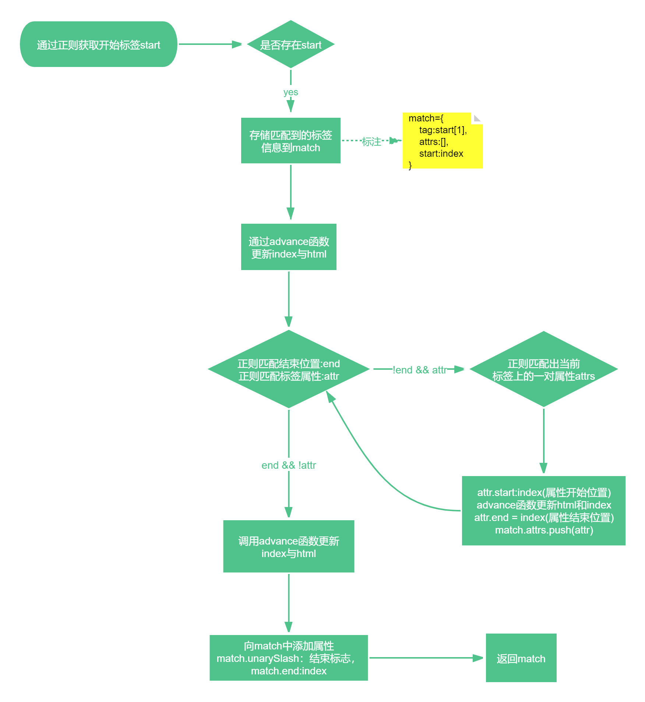

## parseStartTag:解析标签，以及标签上的属性。


#### 函数执行流程图


#### 函数背景：
    该函数被定义在parseHTML函数中，作为parseHTML的局部函数。
  
#### 函数简介：

    1：通过正则匹配标签开始位置:/^<((?:[a-zA-Z_][\-\.0-9_a-zA-Z]*)?[a-zA-Z_][\-\.0-9_a-zA-Z]*)/ match 出标签名
   
    2：记录正则出来的内容  match={tagName:'标签名',attrs:[标签属性],start:开始的位置}
    
    3：通过正则判断当前是否单个结束标签并且拥有属性
         匹配标签结束位置：/^\s*(\/?)>/  确认当前是否单个闭合标签
         
         匹配标签属性：/^\s*([^\s"'<>\/=]+)(?:\s*(=)\s*(?:"([^"]*)"+|'([^']*)'+|([^\s"'=<>`]+)))?/;
        3.1:当标签不是结束位置且拥有属性时，给match.attrs 赋值匹配到的attr ，并更新html和index ，返回match
        3.2：当是结束位置时，给match上添加 unarySlash属性，值为匹配到的关闭符号（空字符串或/），并返回match 
```
返回的对象
{
    tagName:标签名称
    attrs:[matchVal1,matchVal2] //标签属性集合，每项都是match正则得到的数组
    start:标签开始位置
    end:标签结束的位置
    unarySlash：标签闭合的内容，一般为空 或者  /
}

function parseStartTag () {
    //通过正则获取当前模板的开始标签
    const start = html.match(startTagOpen)
    if (start) {
      const match = {
        tagName: start[1],
        attrs: [],
        start: index
      }
      //更新index，html
      advance(start[0].length)
      let end, attr
       //当前标签是否结束，并且带有属性，获取属性。
      while (!(end = html.match(startTagClose)) && (attr = html.match(dynamicArgAttribute) || html.match(attribute))) {
        attr.start = index
        ///截取获取新的html，去掉正则出来的属性。
        advance(attr[0].length)
        attr.end = index
        match.attrs.push(attr)
      }
      if (end) {
        match.unarySlash = end[1]
        advance(end[0].length)
        match.end = index
        return match
      }
    }
}


