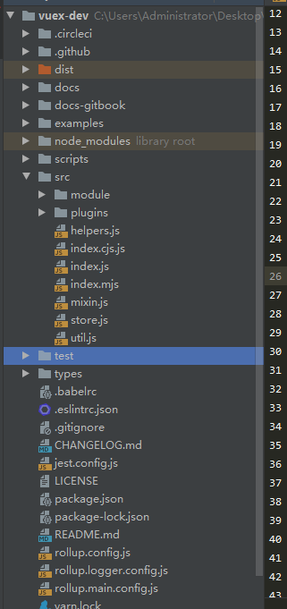

Vue的核心插件Vuex，用来管理应用中的状态，下面我们将一起来看看Vuex的源码，并对一些常用的API进行讲解。

## 目录接口
Vuex的源码被托管在github上，我们首先通过git将代码clone下来，用心仪的IDE打开，文件目录如下。



如图所示，Vuex的主要代码都在src文件夹下，examples文件夹下放一些栗子，解析源码时，我们运行栗子进行断点调试进行跟进会更容易理解，首先npm install安装一下依赖包
在运行前我们需要修改一个地方，首先先找到目录中的package.json文件，注意scripts中的第一项 "dev": "node examples/server.js" ，我们运行
npm run dev 对应的就好走这行,既会自动 node examples/server.js 命令，node会启动example下的server.js,我们打开examples文件，看到一些栗子、
server.js 和 webpack.config.js文件，在server文件我们会启动一个node的本地服务器，在里面会用webpack进行打包，对应的webpack配置文件就是 webpack.config.js，
在这个配置文件中我们加上 devtool: 'source-map'，使得我们在打断点时可以打在源src文件上，不用在编译后的代码中进行调试。

## 源码解析

#### 从入口开始
```
import { Store, install } from './store'
import { mapState, mapMutations, mapGetters, mapActions, createNamespacedHelpers } from './helpers'
import createLogger from './plugins/logger'

export default {
    Store,
    install,
    version: '__VERSION__',
    mapState,
    mapMutations,
    mapGetters,
    mapActions,
    createNamespacedHelpers,
    createLogger
}

export {
    Store,
    install,
    mapState,
    mapMutations,
    mapGetters,
    mapActions,
    createNamespacedHelpers,
    createLogger
}

```
如上述代码所示，我们一目了然的看到Vuex对外暴露的API，在入口我们先导入主要Store，install，然后就是一些辅助方法，然后在将其用两种方法导出。下面我们先主要
分析一下Store和install

#### 安装Store插件的Install方法
在Vue安装插件需要调用Vue.use(plugin)来安装对应插件，在Vue中use的实现其实就是调用当前插件身上的install方法进行安装，
但是在Store对象上并没有install方法，那是怎么实现的，在store.js文件中我们需要注意如下代码。
```
//store.js文件中的部分代码
import applyMixin from './mixin'
//code...
let Vue
export class Store {
    constructor (options = {}) {
    
        if (!Vue && typeof window !== 'undefined' && window.Vue) {
            install(window.Vue)
        }
        //code. ...
    }
}

```
在store.js中先设置一个全局变量Vue，在Store构造函数中判断当前是否拥有全局Vue，并且当前环境拥有全局引用Vue，也就是window上有Vue这个对象，
然后执行install，对全局变量Vue的判断主要保证install只执行一次，然后我们看看install方法
```
export function install (_Vue) {
  if (Vue && _Vue === Vue) {
    if (__DEV__) {
      console.error(
        '[vuex] already installed. Vue.use(Vuex) should be called only once.'
      )
    }
    return
  }
  Vue = _Vue
  // applyMixin 在2.0版本中：每个组件混入beforeCreate构造函数，在每个组件实例上挂载$store属性，使得在每个组件实例中我们都能访问$store  既this.$store
  applyMixin(Vue)
}

//mixin.js文件
//省略版本控制部分
export default function(Vue){
    Vue.mixin({ beforeCreate: vuexInit });

    function vuexInit(){
        const options = this.$options
        // store injection
        if (options.store) {
            this.$store = typeof options.store === 'function'
                ? options.store()
                : options.store
        } else if (options.parent && options.parent.$store) {
            this.$store = options.parent.$store
        }
    }
}
```
install调用时我们比较一下当前的Vue和window.Vue,确保install只执行一次，在将window.Vue赋值给Vue,最后调用applyMixin，
在applyMixin函数中我们用Vue.mixin混入beforeCreate钩子函数，该钩子函数确保我们在Vue的任何组件上我们都可以通过thus.$store
来访问当前的Store实例。

#### 认识Store构造函数
我们在使用Vuex的时候，通常需要传入一个对象去实例化Store类，这个对象包含state、mutations、actions、getters、modules,那么在实例化的过程中
到底做过什么，让我们来来看看下面的代码
```
export class Store {
    constructor (options = {}) {
        if (!Vue && typeof window !== 'undefined' && window.Vue) {
            install(window.Vue)
        }
        if (__DEV__) {
            assert(Vue, `must call Vue.use(Vuex) before creating a store instance.`)
            assert(typeof Promise !== 'undefined', `vuex requires a Promise polyfill in this browser.`)
            assert(this instanceof Store, `store must be called with the new operator.`)
        }
        const {
            plugins = [],
            strict = false
        } = options

        this._committing = false
        this._actions = Object.create(null)
        this._actionSubscribers = []
        this._mutations = Object.create(null)
        this._wrappedGetters = Object.create(null)
        this._modules = new ModuleCollection(options)
        this._modulesNamespaceMap = Object.create(null)
        this._subscribers = []
        
        this._watcherVM = new Vue()
        this._makeLocalGettersCache = Object.create(null)
        
        // bind commit and dispatch to self
        const store = this
        const { dispatch, commit } = this
        this.dispatch = function boundDispatch (type, payload) {
            return dispatch.call(store, type, payload)
        }
        this.commit = function boundCommit (type, payload, options) {
            return commit.call(store, type, payload, options)
        }
        this.strict = strict
        const state = this._modules.root.state
       
        installModule(this, state, [], this._modules.root)
        resetStoreVM(this, state)
        plugins.forEach(plugin => plugin(this))
        const useDevtools = options.devtools !== undefined ? options.devtools : Vue.config.devtools
        if (useDevtools) {
            devtoolPlugin(this)
        }
    }
}
```
首先是我们之前说到的install函数的调动，然后在开发环境下Vuex进行了一些断言判断操作。

断言：必须保证当前Vue的存在，因为后面的时候我们会依赖他
```
assert(Vue, `must call Vue.use(Vuex) before creating a store instance.`)
```
断言：必须保证当前浏览器环境必须兼容Promise，否则需要提供一个Promise polyfill
```
assert(typeof Promise !== 'undefined', `vuex requires a Promise polyfill in this browser.`)
```


